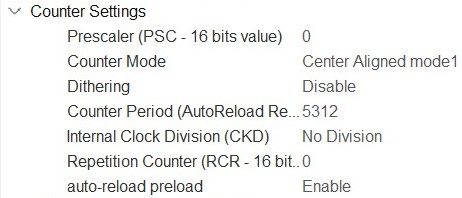
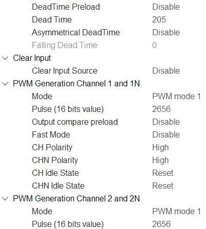
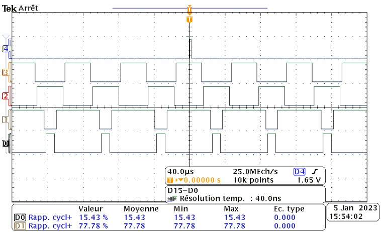
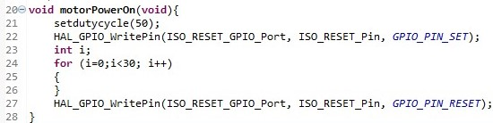
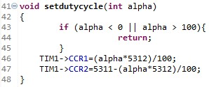

# Commande Numérique d'une MCC
Projet AEI de Guillaume Baudouin et Rubens Baudoin pour la commande en courant et en tension d'une MCC

### Matériel à disposition
-Nucléo-G474RE
-Hacheur Microchip dsPICDEM MC1L
-Moteur à courant continu 530W

### Avancement du projet
-Génération des PWM: OK
-Mise en place de la commande start: OK
-Réglage du rapport cyclique: OK
-Mesure de courant: OK
-Mesure de la vitesse: OK
-Asservissement de la MCC:

## Génération des PWM et première commande de la MCC
Dans cette partie, nous allons:
-Générer les PWM qui permettent la commande en complémentaire du hacheur
-Implémenter des fonctions pour initialiser le hacheur et changer le raport cyclique des PWM

### Configuration du Timer 1
Pour avoir une commande complémentaire, nous utilisons les channels du timer ainsi:
|Channel|Mode|
|-|-|
|1|PWM geneneration CH1 CH1N|
|2|PWM geneneration CH2 CH2N|

Ensuite, nous voulons une fréquence du counter de 16kHz. Le timer étant cadencé à 170MHz cela donne ARR=(170x10^6/16x10^3-1)/2=5312 avec le counter en mode "center align"

##### Counter Settings

Afin d'éviter que tous les transistors ne conduisent pas en même temps, on introduit un dead time de 2 us et on initialise les PWM avec un rapport cyclique de 50% afin de démarrer avec une vitesse nulle
##### Dead time and PWM Settings

Nous vérifions notre code sur l'oscilloscope:

##### Mesures sur l'oscilloscope

On vérifie que la fréquence, le temps mort et les rapports cycliques sont corrects. 

Sur l'écran on aperçoit aussi une impulsion de 2 us qui correspond à la commande start que l'on va détailler ci-dessous:

### Fonctions de commande simple

Pour reset le hacheur et ses capteurs, il faut lui envoyer une impulsion d'au moins 2 us sur le pin ISO_RESET.
On le réalise avec la fonction motorPowerOn:
##### motorPowerOn

La fonction consiste à mettre le pin ISO_RESET à 1 puis faire une boucle for de 31 itérations ce qui correspond à 2us, à la fin de cette dernière, on remet le pin à 0, cette technique est facile à mettre en oeuvre mais est peu précise.
Comme nous sommes en commande complémentaire décalée, nous imposons la valeur de alpha à 50 au démarrage pour que je moteur ne se mette pas à touner directement.  
Une fois le hacheur initialisé, on créé une fonction qui permet de changer la valeur du rapport cyclique des PWM:
L'argument en entrée doit être compris entre 0 et 100, il y a donc une vérification avant de changer la valeur des rapports cycliques de la sorte:

##### setDutyCycle

## Connection du hacheur et démarrage de la MCC
Nous nous connectons aux bras Yellow et Red du hacheur car ils posèdent des capteurs à effet hall, utiles pour la suite.

|Signal|Pin du SubD-37|
|-|-|
|ISO_RESET|pin 33|
|CMD_Y_TOP|pin 12|
|CMD_R_TOP|pin 13|
|CMD_Y_BOT|pin 30|
|CMD_R_BOT|pin 31|

Maintenant nous appelons les fonctions à l'aide de commandes shell pour interragir dynamiquement avec le moteur. 
Puisque il n'est pas asservi, lors d'un changement de rapport cyclique trop brusque le hacheur se met en défaut.
Nous décidons alors d'ajouter une ligne à la commande "motorPowerOn" qui remet le rapport cyclique à 50% (Vitesse nulle) et commençons à mettre en place l'asservissement:

## Asservissement de la MCC

Pour réaliser l'asservissement, nous devons traiter les retours capteurs de courants dans un premier temps puis la vitesse.

### Boucle de courant
Nous utilisons l'ADC1,cadencé à 160kHz par le Timer 2 pour mesurer le courant donné par le capteur à effet hall.
Celui-ci délivre une tension comprise entre 0 et 5V. Ainsi, les courants négatifs sont
représentés par une tension inférieure à 2,5V et les courants positifs sont représentés par une tension
supérieure à 2,5V (0A correspond ainsi à environ 2,5V.) 

Les données lues par l'ADC vont être traîtées par des requêtes DMA afin d'optimiser le transfert des données sans charger le CPU.
Le DMA retient 10 valeurs de mesure du courant, sur lequelles nous allons en déduire un notre courant moyen. 
Cela permet de gagner en précision car le courant du le moteur comporte de très grandes variations.

## Paramètres ADC

On va donc lancer 1 conversion  sur chaque front montant du timer 2, le timer 2 étant mis à 160 kHz, la PWM 16 kHz, on a donc 10 mesures par l'ADC sur une période de PWM.

"HAL_ADC_Start_DMA(&hadc1, adc_values, 10);" permet de lancer l'adc avec le DMA et stoacker 10 valeurs mesurées dans le tableau adc_Values.
"HAL_TIM_Base_Start(&htim2);"permet de lancer le Timer2 qui va ainsi cadencer les mesures.
Ces deux lignes sont utilisées à l'initiation.

Le DMA est en mode circular, c'est à dire qu'il recharge des nouvelles mesures dans le tableau en permanence.
Cela permet de lire en temps réel le courant.

Enfin, quand l'utilisateur tape "mesure" le courant dans le terminal , on fait la moyenne des mesures des courant et on l'affiche sur le terminal. 

Cette moyenne est stockée dans un chaine de caractères par la fonction sprintf pour être affichée "sprintf(chaine," Courant = %.3f A \r\n",Imoyen);"

## Mesure de la Vitesse
Pour mesurer la vitesse, nous utilisons les roues codeuses présentent sur les MCC.
Ces 2 roues nous renvoies 2 signaux, A et B. 
Nous allons compter les fronts montants et descendants sur ces signaux, 4096 ticks sur un tour.

Nous utilisons le Timer3 en mode counter pour compter les incréments sur les roues codeuses et le Timer5 pour récupérer la valeur du codeur à une fréquence de 10Hz.

Le TIM3 doit être initialiser à son point milieu pour éviter que la vitesse fasse un bond si le moteur passe en marche arrière ce qui ferai passer le compteur de 0 a 65535.
Enfin le Timer 3 doit être utilisé en encoder avec le mode "ENCODER MODE TI1 and TI2".

Dans un premier temps on traite l'interruption envoyée par TIM5, nous utlisons pour cela la fonction HAL_TIM_PeriodElapsedCallBack:
On remet la valeur de TIM3 à son point milieu pour la prochaine mesure. 

La vitesse est calculée via la fonction motorSpeed.

Cette dernière est appelée quand l'utilisateur rentre "vitesse" dans l'invite de commande.

Les résultats obenue sont concluants, quand on a 700 tour/sc renvoyé sur le shell on a une tension de 7V sur la tachy du moteur.

## Annexe
Pinout du connecteur Sub-D 37: (Les pins indiqués sur la carte sont faux)
ISO_RESET: pin 33
CMD_Y_TOP: pin 12
CMD_R_TOP: pin 13
CMD_Y_BOT: pin 30 
CMD_R_BOT: pin 31 

Mise en route du hacheur:

Commande “start” ou power up sequence:
-Mise sous tension de la carte de commande au préalable connectée au hacheur
-Mise sous tension de l’alimentation DC du hacheur
-"power on" Reset système avec un signal haut sur la ligne ISO-RESET. 

Power down sequence:
-Couper l’alimentation DC du hacheur
-Attendre 5 min le temps que la LED du bus DC s'éteigne
-Couper l’alimentation de la carte si besoin
